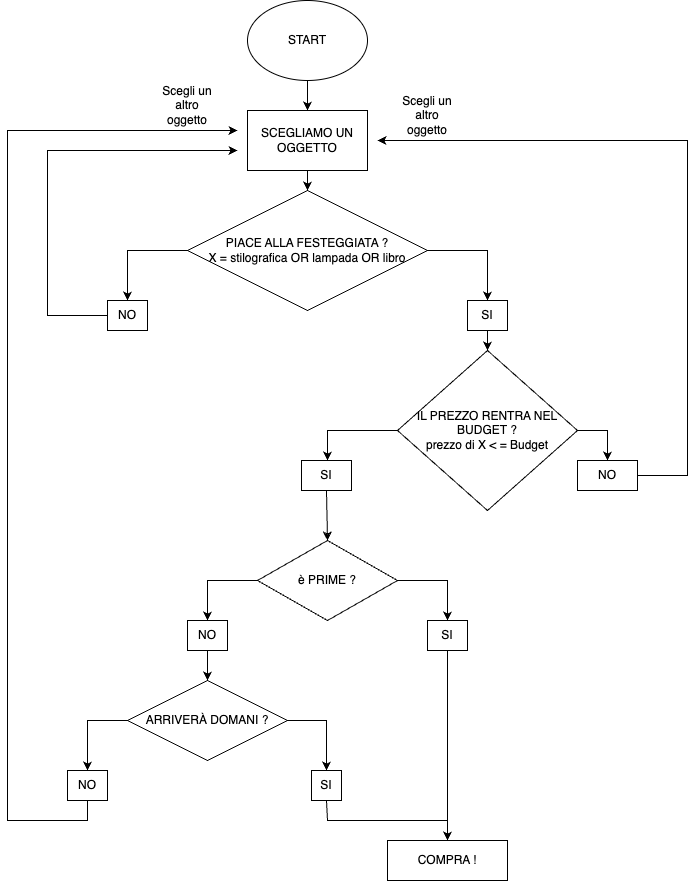

#SCELTA DEL REGALO

- Dati:
    - Gusto della festeggiata.
    - Budget

**1. Si sceglie un oggetto.**
**2. Controllo se l'oggetto rispetta il critetrio della categoria**
    - SE l'oggetto non piace alla festeggiata allora torna al punto 1
    - SE l'oggetto piace continua al punto 3
**3. Controllo il budget ed il prezzo dell'oggetto**
    - SE il prezzo supera il budget allora torna al punto 1
    - SE il prezzo è congruo al budget allora continua al punto 4
**4. Controllo se l'oggetto è prime**
    - SE l'oggetto non è prime continua al punto 5
    - SE l'oggetto arriva domani allora procedi al punto 6
**5. Controllo se l'oggetto arriverà in tempo**
    - SE l'oggetto non arriva domani allora torna al punto 1
    - SE l'oggetto arriva domani allora procedi al punto 6
**6. Compra !**

